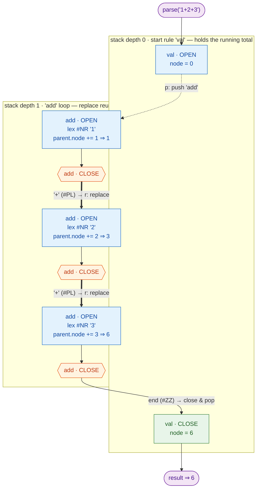

# tabnas

[](https://github.com/tabnas/parser/actions/workflows/build.yml)
[](https://opensource.org/licenses/MIT)

A **pluggable parsing engine**: a configurable rule-based parser running
over a configurable matcher-based lexer. The engine ships **no grammar**
of its own — you bring the grammar as a plugin. tabnas grew out of the
[jsonic](https://github.com/tabnas/jsonic) plugin: lenient JSON for
humans (unquoted keys, implicit objects, comments, trailing commas, path
diving), which is now just one grammar built on this engine.

```
a:1, b:2          →  {"a": 1, "b": 2}
[x y z]           →  ["x", "y", "z"]
a:b:c:1           →  {"a": {"b": {"c": 1}}}
```

## What kind of parser is this?

tabnas is a **rule-based parser** driven by a **matcher-based lexer**, and
it is **grammar-agnostic**:

- **Lexer** — tokens are produced by an ordered list of matchers (fixed
  strings, spaces, lines, strings, comments, numbers, free text). Add or
  replace matchers to recognise new tokens.
- **Parser** — a small rule machine. Each rule has `open` and `close`
  alternatives that match token sequences, push child rules, and build the
  result node. There is no fixed grammar baked in.
- **Plugins** — a grammar is a plugin that registers tokens and rules.
  Compose several plugins to parse a dialect.

A complete grammar is small. Here is a declarative grammar for integer
addition expressions (`1+2+3`):

```js
const { Tabnas } = require('@tabnas/parser')

// Create a new parser.
const tn = new Tabnas()

// Define the grammar.
tn.grammar({

  options: {

    // Define a new token named #PL, a "+" character.
    fixed: { token: { '#PL': '+' } },

    // Start parsing at the 'val' rule.
    rule: { start: 'val' },
  },
  
  rule: {
  
    // The 'val' rule holds the running total.
    // Each rule instance has a 'node' representing its value.
    val: {
    
      // Define the "opening" phase of the rule.
      open:  [
      
        // This is an "alternate", it matches any tokens.
        { 
          // "push" down into an 'add' rule.
          p: 'add', 
          
          // An "action" - set the counter to 0.
          a: (r) => { r.node = 0 } 
        }
       ]
       
      // Define the "closing" phase of the rule.
      close: [
        {} // Ending "alternate" - does nothing.
      ]
    }
    
    // The 'add' rule performs the addition.
    add: {
      open:  [
        { 
          // Match a number - #NR is a built-in token for numbers.
          s: '#NR',
          
          // Add the number to the total.
          a: (r) => { 
            r.parent.node +=  // The parent is the 'val'. 
              r.o[0].val      // Get the value of the first opening token. 
          } 
        }
      ],
      close: [
        // If there is a "+" following the number, keep going.
        { 
          s: '#PL', // This is our "+" token, #PL
          r: 'add'  // 'Repeat" the 'add' rule
        }, 
        
        // Else end the rule.
        {}
      ]
    }
  }
})

tn.parse('1+2+3')   // => 6
tn.parse('10+20')   // => 30
```


You can debug the parser using the  [`@tabnas/debug`](https://github.com/tabnas/debug)) plugin:


```
========= ABNF =========
val = add
add = NR [ PL add ]

NR = <number>
PL = "+"

    
========= RULES =========
  val:
    op: add        ← val OPEN pushes `add`
  add:
    cr: add        ← add CLOSE replaces with `add`  (the `+` loop)

========= ALTS =========
  val:
    OPEN:   0 []                p=add   A      ← push add, run action (init node=0)
    CLOSE:  0 []
  add:
    OPEN:   0 [#NR]             A             ← match a number, run action (+= number)
    CLOSE:  0 [#PL]             r=add         ← on `+`, replace with add
            1 []                              ← else, end
```


Here is how `1+2+3` is parsed, step by step. **Push** (`p`) descends into
the `add` loop; **replace** (`r`) loops within a single stack frame; the
running total accumulates on the `val` node:



- **Dotted edge** = `p` push: `val` descends into the `add` loop (depth 0 → 1).
- **Thick edges** = `r` replace: each `+` swaps `add` for the next `add` at the
  *same* depth — the whole loop lives in one stack frame (no growth).
- **Plain edge** = close & pop: end-of-source (`#ZZ`) ends the loop, popping
  back to `val`, which closes returning the total.


## TypeScript is canonical; Go follows

The **TypeScript implementation is the original and canonical** engine —
it defines the behaviour, the API shape, and the conformance fixtures. The
**Go port follows that functionality**: same engine model, same grammar-free
design, same layout, validated against the same shared fixtures. When the
two ever differ, the TypeScript behaviour is authoritative.

## Choose your runtime

| Runtime | Package / module | Start here |
|---|---|---|
| **TypeScript / JavaScript** — original & canonical | `@tabnas/parser` (npm) | [`ts/README.md`](ts/README.md) |
| **Go** — port that follows the TS engine | `github.com/tabnas/parser/go` | [`go/README.md`](go/README.md) |

## Documentation

The docs are organised by what you are trying to do, symmetrically for both
runtimes:

- **Learning the basics** — tutorials walk you from an empty file to a
  working parse: [TypeScript tutorial](ts/doc/tutorial.md) ·
  [Go tutorial](go/doc/tutorial.md).
- **Getting a specific job done** — how-to recipes:
  [TypeScript guides](ts/doc/guide.md) · [Go guides](go/doc/guide.md);
  plugin authoring [TS](ts/doc/plugins.md) · [Go](go/doc/plugins.md).
- **Looking something up** — reference for every option, method, and rule:
  the shared [syntax reference](doc/syntax.md), plus per-language API
  ([TS](ts/doc/api.md) · [Go](go/doc/api.md)) and options
  ([TS](ts/doc/options.md) · [Go](go/doc/options.md)).
- **Understanding how it works** — the shared
  [architecture](doc/architecture.md), and per-language concept notes
  ([TS](ts/doc/concepts.md) · [Go](go/doc/concepts.md)). Porting from TS to
  Go? See [differences](go/doc/differences.md).

## Repository layout

| Path | What it is |
|---|---|
| [`ts/`](ts/) | The canonical TypeScript engine (the `@tabnas/parser` npm package). |
| [`go/`](go/) | The Go port (`github.com/tabnas/parser/go`) — grammar-free, same layout as TS. |
| [`test/spec/`](test/spec/) | Shared `.tsv` conformance fixtures, run by both runtimes. |
| [`doc/`](doc/) | Language-neutral docs: the [syntax reference](doc/syntax.md) and the [architecture explanation](doc/architecture.md). |

Working on the codebase itself? Each directory has an `AGENTS.md` with
build, test, and contribution notes; start with [`AGENTS.md`](AGENTS.md).

## Legacy version

The original project was [`jsonicjs/jsonic`](https://github.com/jsonicjs/jsonic)
— now the **legacy version**. Its engine has been generalised into tabnas,
and the relaxed-JSON grammar lives on as the
[jsonic](https://github.com/tabnas/jsonic) plugin. New work should target
tabnas and the `@tabnas/*` plugins.

## Sponsored by

This open source module is sponsored and supported by
[Voxgig](https://www.voxgig.com).

## License

MIT. Copyright (c) 2013-2026 Richard Rodger.


## Tábla na nAistrithe — “The Table of Transitions.” - (tabnas)

Is é Tábla na nAistrithe ainm an innill seo. Is gléas é déanta d’adhmad, de rothaí fiaclacha, de luamháin, agus de phionnaí. Tá stiall phár ann, agus comharthaí scríofa uirthi. Léann lámh bheag an innill comhartha amháin, féachann sí ar staid an innill, agus de réir rialacha Tábla na nAistrithe scríobhann sí comhartha nua, athraíonn sí a staid, agus bogann sí cearnóg amháin ar chlé nó ar dheis. Nuair nach bhfuil riail eile le leanúint aici, tagann Tábla na nAistrithe chun suaimhnis.
