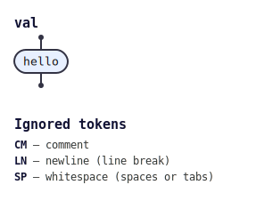

# tabnas

A pluggable parsing engine. The runtime is a class — `Tabnas` — that
runs a rule-based parser over a configurable matcher-based lexer. The
package ships **no grammar** of its own: every grammar is a plugin
that you (or another package) supply.

```bash
npm install @tabnas/parser
```

A tiny taste — a one-token grammar defined inline:

```js
const { Tabnas } = require('@tabnas/parser')

const tn = new Tabnas({ plugins: [(tn) => {
  tn.options({ fixed: { token: { '#HI': 'hello' } } })
  tn.rule('val', (rs) => rs.open([
    { s: ['#HI'], a: (r) => { r.node = 'world' } },
  ]))
}] })

tn.parse('hello')                     // 'world'
```

That grammar as a railroad/syntax diagram, generated from the live parser
with [`@tabnas/railroad`](https://github.com/tabnas/railroad):



A vertical ASCII version is in [`doc/taste.txt`](doc/taste.txt).

## Documentation

- [Tutorial](doc/tutorial.md) — build your first parser, step by step.
- [How-to guides](doc/guide.md) — short recipes for common tasks.
- [Writing plugins](doc/plugins.md) — author a grammar or tooling
  plugin.
- [API reference](doc/api.md) — every public method, property, and
  export.
- [Options reference](doc/options.md) — every option field and its
  default.
- [Concepts](doc/concepts.md) — how the TypeScript engine is put
  together, and why.

Shared design docs for both runtimes live at the top of the repo:

- [Architecture](../doc/architecture.md) — the engine model.
- [Syntax](../doc/syntax.md) — the relaxed-JSON syntax reference.

### Explanation / design notes

- [BNF feasibility](doc/bnf-to-tabnas-feasibility.md) — turning
  BNF / ABNF into engine rules.
- [LSP feasibility](doc/lsp-feasibility.md) — language-server angles.

## Companion packages

Grammars and tooling ship as separate packages, not in this one:

- `@tabnas/abnf` — compiles ABNF into engine rules and adds
  `tn.bnf(src)`.
- `@tabnas/debug` — tracing and `describe()` helpers.

The strict-JSON grammar used by the conformance tests lives as a test
fixture at [`test/json-plugin.ts`](test/json-plugin.ts) — a worked
example of a non-trivial grammar plugin.

The [Go port](../go/) follows the same grammar-free design, with its
strict-JSON grammar kept as a test fixture too.

## License

MIT. Copyright (c) Richard Rodger.
